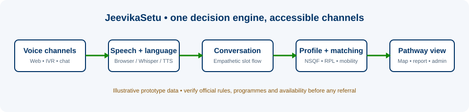

# JeevikaSetu — Voice-first livelihood mapping prototype

> **SIH 2026 • Problem Statement 26097 • Ministry of Social Justice and Empowerment (MoSJE)**
> An **unofficial, functional demo prototype** for an AI-assisted, multilingual livelihood conversation under a PM-AJAY GIA-aligned concept.

JeevikaSetu helps a beneficiary speak naturally about their lived experience, traditional work, goals and constraints. It turns the conversation into a reviewable profile and matches it against an **illustrative NSQF-aligned qualification catalogue** to explain skill gaps, RPL screening, nearby sample training centres and possible GIA referral pathways.



> **Important data notice**: This repository intentionally labels all catalogue data, centres, job/enterprise listings, dashboard totals and GIA pathway notes as **illustrative prototype data**. It is not a live PM-AJAY, NCVET, SIDH, NCS, Bhashini, WhatsApp, Twilio, Vapi or training-provider integration. The prototype never promises eligibility, benefit amounts, enrolment, certification or placement. Verify current rules and source data with authorised agencies before use.

## What works in this prototype

- **Bi-directional browser voice conversation** with large microphone UI, listening → processing → speaking states, real-time subtitles, consent prompt and text fallback.
  - Uses browser Speech Recognition when available (Chrome/Edge provide a practical live Hindi demo path).
  - Includes a `MediaRecorder → /api/voice/transcribe` Whisper path when `OPENAI_API_KEY` is configured.
  - Uses `/api/voice/synthesize` OpenAI TTS when configured; falls back to browser `speechSynthesis` in the selected language.
- **Structured, empathetic interview**: name, location, education, traditional work, current livelihood, interests, work preference, mobility and constraints. The required slot order/persistence is deterministic so the demo is reliable; with an API key GPT improves the short, warm conversational phrasing.
- **Multilingual interface and response flow**: Hindi, English, Marathi, Tamil, Telugu and Bengali selection. Hindi, English and Marathi are first-class scripted paths; the additional regional-language prompts are included for the demo.
- **Beneficiary profile dashboard** with a simple skill signal radar, edit/correct controls and no Aadhaar collection.
- **Explainable recommendations**: 42 illustrative qualification packs across 18 sectors, transparent skill-gap indicators, RPL screening at 80%+, mobility-aware sample centre matching, roadmap and conditional GIA referral prompts.
- **Opportunity catalogue**: 22 sample training centres, 36 sample jobs/self-employment opportunities, 5 fictional personas and 4 carefully non-guaranteed GIA pathway notes.
- **Accessible channels**: browser voice, IVR dial-pad simulation and WhatsApp-style voice-note simulation using the same API/controller.
- **Official / counsellor view**: aggregate, de-identified prototype dashboard; no beneficiary phone, Aadhaar or caste identifier is displayed.
- **Demo reliability controls**: “Demo Mode: Ramesh”, text fallback, downloadable PDF pathway summary and a local screen-record/download control.

## Architecture

```text
Browser voice / IVR simulation / WhatsApp simulation
                 │
                 ▼
       Next.js React portal (relative /api requests)
                 │  rewrite proxy
                 ▼
             FastAPI backend
       ┌─────────┼──────────────────────────┐
       │         │                          │
Browser ASR  Whisper (optional)      Conversation controller
 / TTS        OpenAI TTS (optional)      │
                                         ▼
                              SQLite session + partial profile
                                         │
                                         ▼
                          explainable NSQF/RPL matching engine
                                         │
                                         ▼
                        curated demo catalogue + PDF report
```

The frontend only calls relative `/api/...` URLs. In local development Next.js proxies to FastAPI, preventing browser code from calling `localhost` directly in a preview/deployment. Configure `JEEVIKASETU_API_URL` for another backend host.

## Repository layout

```text
.
├── src/                         # Next.js React 19 frontend
│   ├── app/voice                # Live browser voice interview
│   ├── app/profile              # Extracted beneficiary profile + correction
│   ├── app/recommendations      # NSQF/RPL recommendations, map, PDF action
│   ├── app/ivr                  # Feature-phone IVR simulation
│   ├── app/whatsapp             # WhatsApp-like voice-note simulation
│   ├── app/admin                # Separate de-identified official view
│   └── components/jeevika       # Radar and screen-record controls
├── backend/
│   ├── main.py                  # FastAPI application and endpoint contract
│   ├── services/conversation.py # Consent-aware slot extraction/controller
│   ├── services/recommender.py  # Deterministic explainable matching
│   ├── services/llm_service.py  # Optional OpenAI conversational phrasing
│   ├── data/catalog.json        # Curated **illustrative** demo data
│   ├── prompts/                 # Conversation, profile, recommendation prompts
│   └── api/telephony.py         # Optional Twilio-compatible IVR webhook
└── next.config.ts               # Relative API rewrite proxy
```

The existing repository is a Next.js React app rather than a fresh Vite scaffold. The React/TypeScript implementation was kept in place so its existing routing, Tailwind v4, Leaflet and animation dependencies continue to work.

## Quick start (local demo)

### 1) Start the backend

**Python 3.11+ recommended.** If your system allows normal pip installation, the concise command is:

```bash
cd backend
pip install -r requirements.txt
python main.py
```

On environments that enforce PEP 668 (including many Linux distributions), use a local virtual environment instead:

```bash
cd backend
python -m venv .venv
# macOS/Linux
. .venv/bin/activate
# Windows PowerShell: .\.venv\Scripts\Activate.ps1
pip install -r requirements.txt
python main.py
```

The backend listens on `http://0.0.0.0:8000` and API documentation is at `http://localhost:8000/docs`.

### 2) Start the frontend (new terminal)

```bash
# repository root
npm install
npm run dev -- --hostname 0.0.0.0
```

Open `http://localhost:3000`.

### 3) Optional OpenAI voice + AI enhancement

```bash
cd backend
cp .env.example .env
# Edit .env locally. Do NOT commit it.
OPENAI_API_KEY=your_server_side_key
OPENAI_CHAT_MODEL=gpt-4o-mini
```

With the key present, the prototype enables Whisper in `/api/voice/transcribe`, OpenAI TTS in `/api/voice/synthesize`, and GPT-based natural-language polishing around the deterministic interview state. Without it, the browser voice/text fallback remains fully demoable.

## Judge demo flow (3–5 minutes)

1. **Landing (`/`)** — introduce the voice-first, multilingual, low-literacy design.
2. **Voice (`/voice`)** — consent, choose Hindi, press microphone and say: `Mera naam Ramesh Kumar hai.` Show live subtitle and Hindi reply.
3. Continue 3–4 answers, or use **Demo Mode: Ramesh** if microphone/network is unreliable.
4. **Profile (`/profile`)** — show Ramesh’s traditional leather work, construction experience, mobile-repair aspiration, 30 km mobility and edit capability.
5. **Recommendations (`/recommendations`)** — show Mobile Phone Repair Technician, Leather Goods Maker RPL screen and Construction Supervisor progression. Expand Leather Goods Maker to show the 85% screening signal and bridge gap.
6. Point to the Leaflet/OpenStreetMap sample training centre map, roadmap and conditional GIA pathway notes. Download the PDF summary.
7. **IVR (`/ivr`)** — press `1` for Hindi and open the same interview path.
8. **WhatsApp (`/whatsapp`)** — record a browser voice note, then play the assistant’s voice-note reply.
9. **Official view (`/admin`)** — show anonymous aggregate language/skill/district signals and explain the privacy boundary.

## API surface

| Endpoint | Purpose |
| --- | --- |
| `POST /api/conversation/session` | Create a consent-aware web / IVR / WhatsApp session and greeting |
| `GET /api/conversation/session/{id}` | Continue a saved local conversation |
| `POST /api/conversation/message` | Save a turn, update profile slots, return next conversational reply |
| `POST /api/voice/transcribe` | Audio blob → Whisper transcript when configured; clear browser fallback response otherwise |
| `POST /api/voice/synthesize` | Text → OpenAI MP3 TTS when configured; browser fallback signal otherwise |
| `POST /api/profile/extract` / `PUT /api/profile/{id}` | Read extracted profile / apply user correction |
| `POST /api/recommend` | Explainable qualification, skill-gap, RPL and roadmap output |
| `GET /api/training-centers` / `GET /api/opportunities` | Filtered illustrative local catalogue data |
| `GET /api/nsqf/qualification-packs` | Curated illustrative QP catalogue |
| `POST /api/report/generate` | Beneficiary pathway PDF summary |
| `GET /api/dashboard/stats` | Aggregate demo stats |
| `POST /api/demo/personas/ramesh` | Presentation-safe fictional demo fallback |
| `POST /api/twilio/twiml` | Optional minimal Twilio-compatible inbound IVR response |

## Quality checks run

```bash
npm run lint
npm run build
# Backend smoke tests: health, session, Hindi turn, Ramesh recommendation and PDF report
```

## Production integration boundary

This repository is deliberately safe for a hackathon prototype. Before a pilot or production use, add authenticated official/counsellor roles, encryption and retention rules, consent/audit workflow, verified NCVET QP/NOS source versioning, authorised GIA rule integration, approved training-centre feeds, verified opportunity partners, accessibility/usability testing with communities, and a provider agreement for telephone/WhatsApp channels. Do not make an operational referral based only on this prototype.
